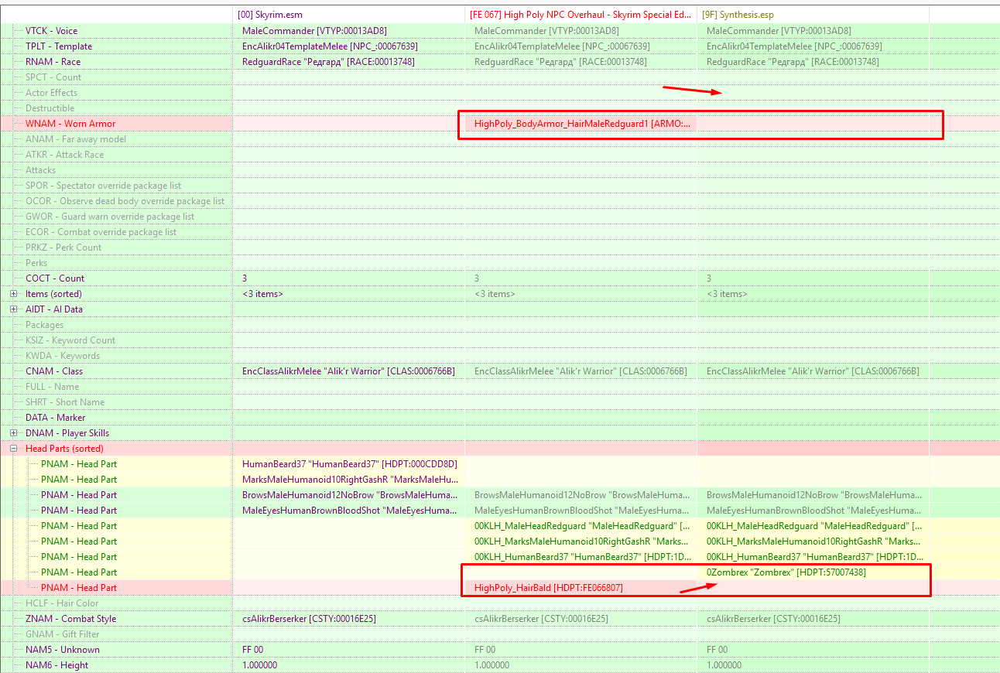

# HP_NPC_WIGS_TO_HEADPART Synthesis patch

Synthesis patch - Convert Wigs to hair headpart for High Poly NPC Overhaul

`KS Hairdos HDT SMP Physics Patch` and `KS Hairdos - HDT SMP (Physics)` must be optional, but not tested without this

Patch is beta (The patch was created for personal use, and may require improvements for various combinations of mods.)

## Requirement

- [High Poly NPC Overhaul - Skyrim Special Edition 2.04](https://www.nexusmods.com/skyrimspecialedition/mods/44155)
- [High Poly NPC Overhaul - Resources 2.06](https://www.nexusmods.com/skyrimspecialedition/mods/42768)
- [High Poly NPC Overhaul - Resources - KS Hairdos HDT SMP Physics Patch 2.05](https://www.nexusmods.com/skyrimspecialedition/mods/42768)

- [KS Hairdos SSE](https://www.nexusmods.com/skyrimspecialedition/mods/6817)
- [KS Hairdos - HDT SMP (Physics)](https://www.nexusmods.com/skyrimspecialedition/mods/31300)
